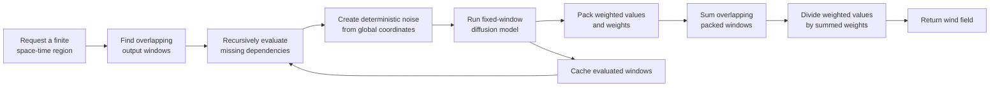
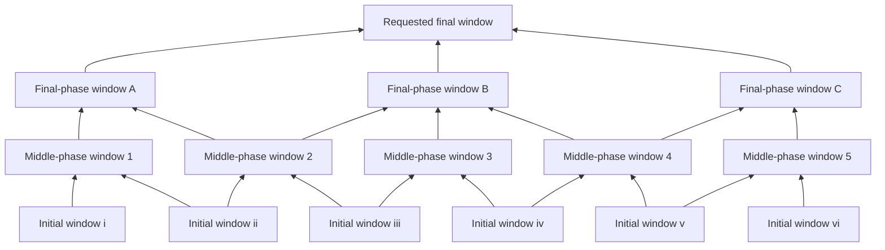

# InfiniteDiffusion Implementation

## Overall Flow



## Overlap Propagation


## Dependency DAG



## Phase Construction

```text
function BUILD_INFINITE_FIELD(T, denoising_steps, split_steps):
    boundaries = [0] + split_steps + [denoising_steps]

    phase[0] = LAZY_OVERLAPPING_TENSOR(
        function(window):
            noise = COORDINATE_NOISE(
                seed,
                window.global_time_coordinates,
                window.global_y_coordinates,
                window.global_x_coordinates
            )

            state = DENOISE_SEGMENT(
                noise,
                start_step = boundaries[0],
                end_step   = boundaries[1]
            )

            weight = WINDOW_WEIGHT(window.shape)
            return PACK(weight * state, weight)
    )

    for phase_index from 1 to T - 1:
        previous_phase = phase[phase_index - 1]

        phase[phase_index] = LAZY_OVERLAPPING_TENSOR(
            dependency = previous_phase,

            function(window, overlapping_previous_windows):
                packed = SUM_OVERLAPS(overlapping_previous_windows)
                previous_state = packed.values / MAX(packed.weights, epsilon)

                state = DENOISE_SEGMENT(
                    previous_state,
                    start_step = boundaries[phase_index],
                    end_step   = boundaries[phase_index + 1]
                )

                weight = WINDOW_WEIGHT(window.shape)
                return PACK(weight * state, weight)
        )

    return phase[T - 1]
```

## Lazy Query

```text
function QUERY(field, requested_region):
    required_final_windows = WINDOWS_COVERING(requested_region)

    for window in required_final_windows:
        EVALUATE_RECURSIVELY(window)

    packed_result = SUM_OVERLAPS(
        cached final windows intersecting requested_region
    )

    normalized_wind =
        packed_result.values / MAX(packed_result.weights, epsilon)

    return DENORMALIZE_AND_SPLIT_UV(normalized_wind)
```

## Recursive Evaluation and Caching

```text
function EVALUATE_RECURSIVELY(window):
    if CACHE_CONTAINS(window):
        return CACHE_GET(window)

    dependencies = PARENT_WINDOWS_REQUIRED_BY(window)

    parent_values = []
    for parent in dependencies:
        parent_values.append(EVALUATE_RECURSIVELY(parent))

    value = window.phase_function(parent_values)
    CACHE_PUT(window, value)
    return value
```
