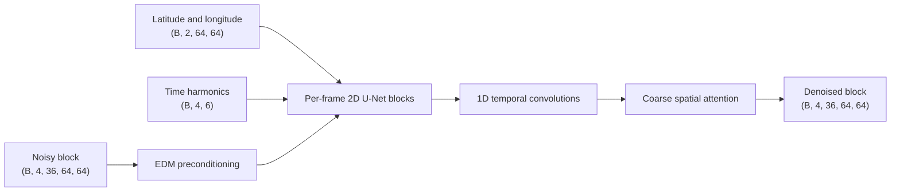
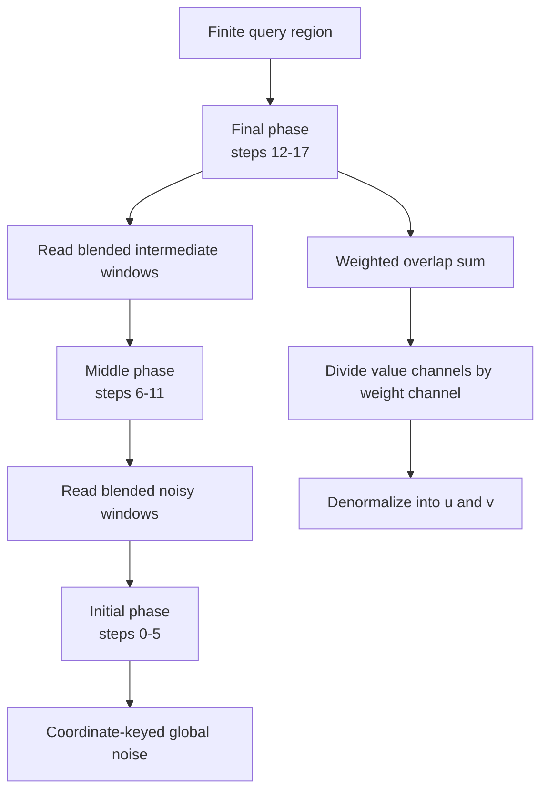

# InfiniteDiffusion Wind Implementation

## 1. Scope

The system has two separate parts:

1. **Base diffusion model:** learns to denoise a fixed `4 x 64 x 64` space-time wind
   block with 18 vertical levels and two wind components.
2. **InfiniteDiffusion wrapper:** repeatedly applies that fixed-window model on overlapping
   windows to expose a lazy, unbounded field over `(time, latitude, longitude)`.

Training changes the base model. The truncation depth `T`, overlap blending, caching, and
lazy query evaluation belong to InfiniteDiffusion inference and do not retrain the model.

## 2. Code Map

| Responsibility | Implementation |
|---|---|
| Conditional space-time dataset | `src/eval/windeval/generators/infinite_diffusion/data.py` |
| Space-time U-Net and EDM loss | `src/eval/windeval/generators/infinite_diffusion/spacetime.py` |
| Training loop and checkpoints | `src/eval/windeval/generators/infinite_diffusion/train.py` |
| Original conditional-model config | `src/eval/windeval/generators/infinite_diffusion/configs/era5_2023_m2cond.yaml` |
| Original temporal launcher | `src/eval/windeval/generators/infinite_diffusion/configs/train_temporal.sbatch` |
| InfiniteDiffusion construction | `src/eval/windeval/generators/infinite_diffusion/spacetime_infinite.py` |
| Condition-set generation | `src/eval/windeval/generators/infinite_diffusion/generate_condition_set.py` |

## 3. Base Diffusion Model

### Input and output

A training example is

\[
x_0 \in \mathbb{R}^{\tau \times 2L \times H \times W},
\]

where `tau=4`, `L=18`, and `H=W=64`. The channels interleave `u` and `v` at ERA5 model
levels 49-66. Each component is normalized using statistics stored in the checkpoint.

The conditional dataset also returns:

- two per-pixel latitude/longitude channels;
- six cyclic time features per frame: annual, semiannual, and diurnal sine/cosine pairs.

Geographic reflection augmentation is disabled because reflected coordinates would
describe a false location.

### Network

The model is an EDM-preconditioned, factorized space-time U-Net:

- 2D residual blocks and attention process each spatial frame;
- a 1D temporal convolution follows spatial residual blocks and mixes the four frames;
- altitude remains in the channel dimension;
- latitude/longitude are concatenated as clean spatial conditioning;
- time harmonics are added to the noise embedding.



### EDM objective

For each clean block, training samples one noise level per block:

\[
\log \sigma \sim \mathcal{N}(-1.2, 1.2^2), \qquad
x_\sigma = x_0 + \sigma\epsilon.
\]

The loss is

\[
\mathcal{L}
=
\mathbb{E}\left[
\frac{\sigma^2+\sigma_{\mathrm{data}}^2}
     {(\sigma\sigma_{\mathrm{data}})^2}
\left\|D_\theta(x_\sigma,\sigma,c)-x_0\right\|_2^2
\right].
\]

The optimizer updates the ordinary model weights while an exponential moving average
is maintained. Inference loads the EMA weights.

```text
for step in 1 ... 100000:
    x0, coordinates, time_features = sample_random_4x64x64_ERA5_block()
    x0 = normalize(x0)

    sigma = exp(Normal(-1.2, 1.2))
    noisy = x0 + sigma * Normal(0, I)
    prediction = EDM_model(noisy, sigma, coordinates, time_features)
    loss = EDM_weight(sigma) * mean_squared_error(prediction, x0)

    optimizer.zero_grad()
    loss.backward()
    optimizer.step()
    update_EMA_weights()

    periodically_save(model, EMA, optimizer, normalization, configuration)
```

## 4. InfiniteDiffusion Construction

### Infinite tensor

Channels are finite, while time and both horizontal axes are unbounded:

\[
\text{shape}=(C+1,\infty,\infty,\infty).
\]

The extra channel stores blending weight. A model window has shape
`(C, 4, 64, 64)` and normally advances by `(2, 32, 32)`, producing 50% overlap along
time, latitude, and longitude.

Each window emits

\[
\operatorname{pack}(X_i)
=
\begin{bmatrix}
W_i \odot X_i \\
W_i
\end{bmatrix}.
\]

`InfiniteTensor` adds all packed windows covering a requested coordinate. The final field
is their normalized weighted sum:

\[
X(q)=
\frac{\sum_{i:q\in i}W_i(q)X_i(q)}
     {\sum_{i:q\in i}W_i(q)}.
\]

The separable linear window gives larger weight to window centers and a small nonzero
weight at edges.

### Deterministic global noise

Initial noise is keyed by absolute `(channel, time, y, x, seed)` coordinates. Therefore,
the same global coordinate receives the same noise regardless of which overlapping
window requests it or in which order queries arrive.

### Truncation depth

`T` is the number of **outer overlap-propagation phases**, not the number of EDM denoising
steps. The base sampler currently uses 18 Heun steps.

- `T=1`: each window performs all 18 steps, then final outputs are blended.
- `T=2`, split 9: steps 0-8 run per initial window; intermediate states are blended;
  steps 9-17 continue from that blended field.
- `T=3`, splits 6 and 12: blend after steps 0-5, blend again after steps 6-11, then
  complete steps 12-17.



Later phases depend on larger neighborhoods from earlier phases. This forms a directed
acyclic graph: dependencies always point from a later phase to an earlier phase. The
required number of windows grows rapidly with `T`, producing the dependency pyramid.

### Construction pseudocode

```text
boundaries = [0] + split_steps + [18]

phase[0] = InfiniteTensor(
    output_window = overlapping_4x64x64_window,
    function(window_coordinate):
        noise = deterministic_coordinate_noise(window_coordinate, seed)
        state = heun_steps(noise, boundaries[0], boundaries[1])
        return concatenate(weight * state, weight)
)

for k in 1 ... T-1:
    phase[k] = InfiniteTensor(
        argument = phase[k-1],
        argument_window = overlapping_4x64x64_window,
        function(window_coordinate, packed_previous):
            previous = packed_previous.values / packed_previous.weights
            state = heun_steps(previous, boundaries[k], boundaries[k+1])
            return concatenate(weight * state, weight)
    )

final_tensor = phase[T-1]
```

### Query pseudocode

```text
function field_uv(t0, t1, y0, y1, x0, x1):
    packed = final_tensor[:, t0:t1, y0:y1, x0:x1]

    # InfiniteTensor recursively computes only missing dependency windows.
    normalized = packed.value_channels / max(packed.weight_channel, epsilon)

    physical_wind = checkpoint_statistics.denormalize(normalized)
    reshape channels into [time, level, component, y, x]
    return physical_wind.u, physical_wind.v
```

## 5. Operational Properties

The implementation preserves three central InfiniteDiffusion properties:

1. **Unbounded extent:** time, latitude, and longitude have no fixed tensor boundary.
2. **Query consistency:** coordinate-keyed noise, deterministic Heun integration, and
   cached phase tiles make repeated or overlapping queries return identical shared values.
3. **Lazy finite computation:** a finite query evaluates only the finite dependency DAG
   needed for that query. Higher `T` increases that finite cost substantially.

The wrapper does not guarantee that generated winds match ERA5. Realism is determined
primarily by the trained block denoiser and is measured separately from seam quality and
query consistency.

## 6. Reusing the Original Training Script

The base training methodology can be reused.

`configs/train_temporal.sbatch` is only a SLURM launcher. It eventually runs:

```text
python train.py --config <configuration.yaml>
```

For the conditional checkpoint used by the current experiments, the required
configuration is:

```text
configs/era5_2023_m2cond.yaml
```

The launch on Kahan would therefore require:

```text
CONFIG=src/eval/windeval/generators/infinite_diffusion/configs/era5_2023_m2cond.yaml
sbatch src/eval/windeval/generators/infinite_diffusion/configs/train_temporal.sbatch
```

The launcher cannot be reused unchanged on Unicorn because it hardcodes:

- Kahan storage under `/zooper2`;
- Kahan MIG GPU resource names such as `gpu:gpu48`;
- a Kahan-specific virtual environment;
- M3 as its default configuration.

On Unicorn, reuse `train.py`, the conditional M2 configuration, model architecture,
optimizer, EMA, update count, and checkpoint format. Replace only the SLURM resources,
paths, and data location. The existing Dean wrapper
`configs/train_era5_2018_2021_dean.sbatch` already does this for the postponed multiyear
training run.
